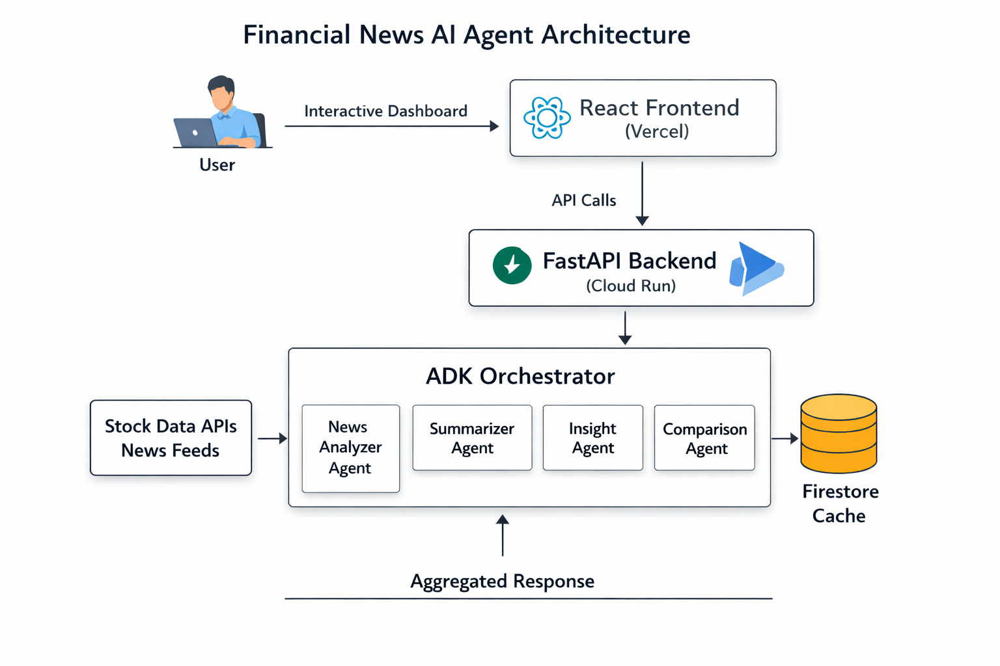

# Financial News AI Agent

An **AI-powered financial intelligence platform** that analyzes company news, evaluates market sentiment, generates investment insights, and enables company comparisons using an **Agentic AI workflow architecture**.

Built using **FastAPI, React, Firebase Authentication, Firestore, Gemini AI, and Google Cloud Run**, the platform delivers personalized financial insights with intelligent caching and user-specific history tracking.

---

## Features

### AI-Powered Financial Analysis

* Company financial news analysis using **Gemini LLM**
* AI-generated investment insights
* Sentiment classification (**Positive / Neutral / Negative**)
* Confidence score generation
* Stock performance visualization

### Company Intelligence

* Analyze public companies
* Compare two companies side-by-side
* AI-generated comparison reasoning
* Recommendation engine

### Personalized User Experience

* **Google Authentication (Firebase)**
* User-specific search history
* Protected dashboard access
* Persistent report tracking

### Smart Performance Optimization

* **3-hour intelligent caching**
* Fresh pipeline execution after cache expiry
* Reduced API cost using merged agent workflow

### Cloud-Native Deployment

* Frontend hosted on **Vercel**
* Backend hosted on **Google Cloud Run**
* Firestore database integration

---

## Tech Stack

## Frontend

* React
* Vite
* Tailwind CSS
* Axios
* Recharts
* Firebase Authentication

## Backend

* FastAPI
* Python
* Google Gemini API
* Firebase Firestore
* Google Cloud Run

## AI Architecture

### Agentic Workflow (ADK-Based)

The backend uses an **agentic orchestration pipeline** to process financial intelligence tasks.

#### Analyzer + Summarizer Agent (Merged)

* Fetches and analyzes financial news
* Summarizes important information
* Reduces LLM API calls for efficiency

#### Insight Generation Agent

* Generates financial insights
* Produces investment recommendations
* Calculates confidence score

#### Comparison Agent

* Compares two companies
* Generates winner reasoning
* Produces AI-based explanation

#### Stock Data Service

* Fetches stock-related information
* Used for visualization and KPIs

---

## Architecture Diagram



---

## Project Structure

```text
financial-news-agent/

├── backend/
│   ├── agents/
│   │   ├── comparison_agent.py
│   │   ├── insight_agent.py
│   │
│   ├── orchestrator/
│   │   └── adk/
│   │       ├── graph.py
│   │       ├── nodes.py
│   │       └── runner.py
│   │
│   ├── services/
│   │   ├── db.py
│   │   ├── stock_service.py
│   │   └── response_normalizer.py
│   │
│   ├── app.py
│   └── requirements.txt
│
├── frontend/
│   ├── src/
│   │   ├── components/
│   │   ├── pages/
│   │   ├── firebase.js
│   │   └── App.jsx
│   │
│   ├── package.json
│   └── vite.config.js
│
└── docs/
    └── architecture.png
```

---

## Authentication Flow

1. User signs in using **Google Authentication**
2. Firebase validates the user
3. Dashboard access is granted only to authenticated users
4. User history is stored separately in Firestore

---

## Firestore Database Structure

```text
financial_reports
   └── company_name
         ├── latest analysis data
         └── last_updated

users
   └── user_id
         └── history
               └── timestamp_document
```

---

## Intelligent Caching Strategy

To reduce API cost and improve response time:

* Cached reports are reused for **3 hours**
* If report age < 3 hours → cached response returned
* If report age > 3 hours → fresh AI pipeline executed

This ensures a balance between **freshness and performance**.

---

## Local Setup

### Clone Repository

```bash
git clone https://github.com/your-username/financial-news-agent.git

cd financial-news-agent
```

---

## Backend Setup

```bash
cd backend

python -m venv venv

venv\Scripts\activate

pip install -r requirements.txt
```

### Create `.env`

```env
GEMINI_API_KEY=your_key

GCP_PROJECT_ID=your_project_id
```

### Run Backend

```bash
uvicorn app:app --reload
```

Backend runs on:

```text
http://localhost:8000
```

---

## Frontend Setup

```bash
cd frontend

npm install
```

### Create `.env`

```env
VITE_API_BASE_URL=http://localhost:8000

VITE_FIREBASE_API_KEY=your_key
VITE_FIREBASE_AUTH_DOMAIN=your_domain
VITE_FIREBASE_PROJECT_ID=your_project
VITE_FIREBASE_STORAGE_BUCKET=your_bucket
VITE_FIREBASE_MESSAGING_SENDER_ID=your_sender_id
VITE_FIREBASE_APP_ID=your_app_id
```

### Run Frontend

```bash
npm run dev
```

Frontend runs on:

```text
http://localhost:5173
```

---

## API Endpoints

### Analyze Company

```http
GET /run/{company}
```

Example:

```http
GET /run/microsoft?user_id=abc123
```

---

### Compare Companies

```http
GET /compare/{company1}/{company2}
```

Example:

```http
GET /compare/google/microsoft
```

---

### User Search History

```http
GET /history
```

Example:

```http
GET /history?user_id=abc123
```

---

### Company History

```http
GET /history/{company}
```

---

## Deployment

### Frontend

**Vercel**

### Backend

**Google Cloud Run**

### Database

**Firebase Firestore**

### Authentication

**Firebase Authentication (Google Sign-In)**

---

## Future Improvements

* Real-time stock price streaming
* Watchlist support
* Portfolio tracking
* Multi-agent financial reasoning
* PDF report export
* Advanced visualization dashboard

---

## Author

Built by **Vennu Kshithija**
